# easy-hugo

Emacs package for writing blogs made with hugo  

## Screenshot

    M-x easy-hugo-newpost

You can post a new article  

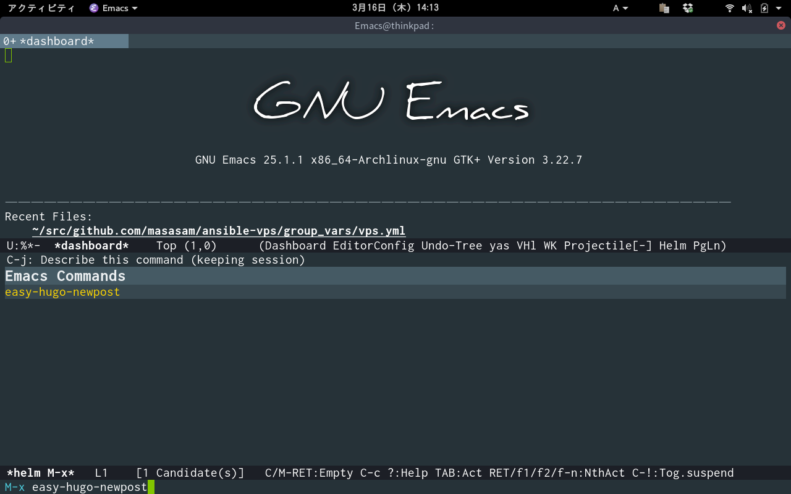

Hit a blog file name  

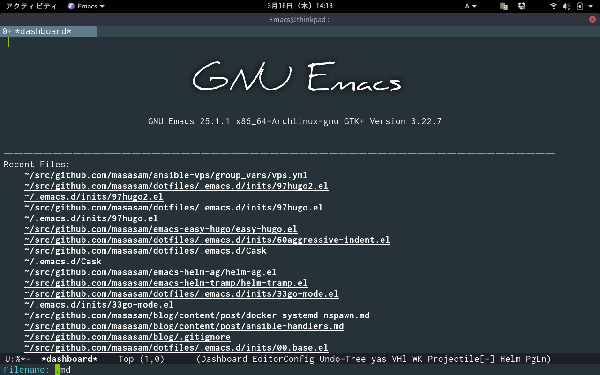

A markdown file is automatically generated  

You can write a blog with markdown  

    M-x easy-hugo-preview  

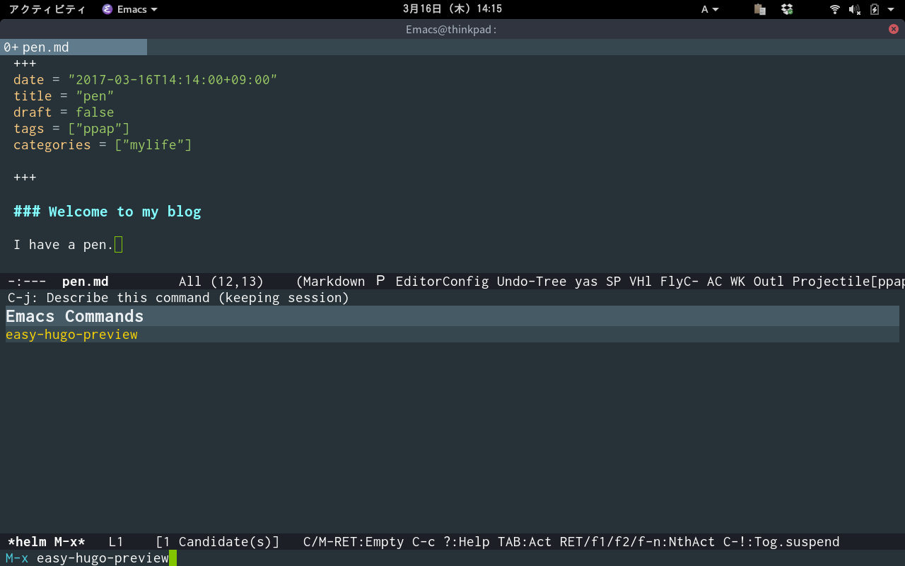

The browser opens automatically and you can preview the blog on your PC  
Since the process of hugo running in the PC disappears in 300 seconds,  
you do not have to worry  
Even if you run the easy-hugo-preview command many times,  
only one hugo process will run so do not mind it  

Let's add another article  

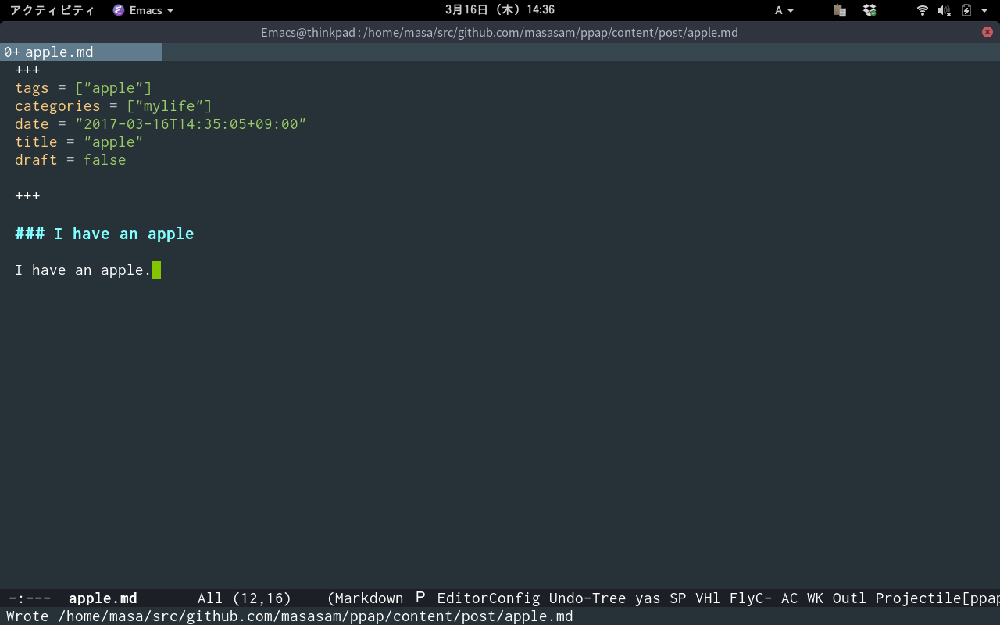

Woo  

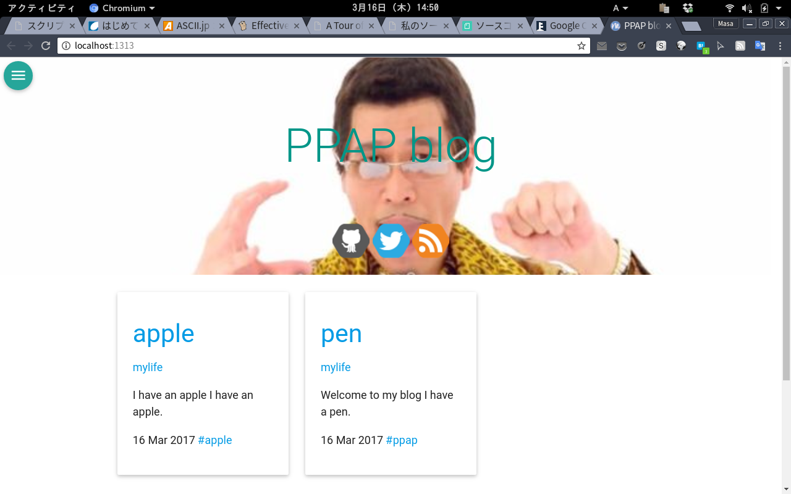

    M-x easy-hugo-publish  

You can publish your blog to the server  

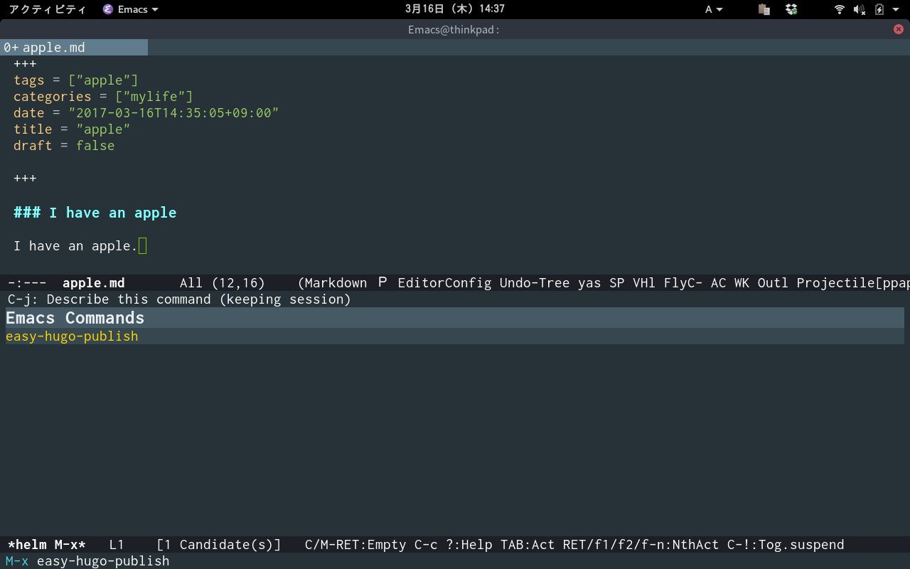

    M-x easy-hugo-article

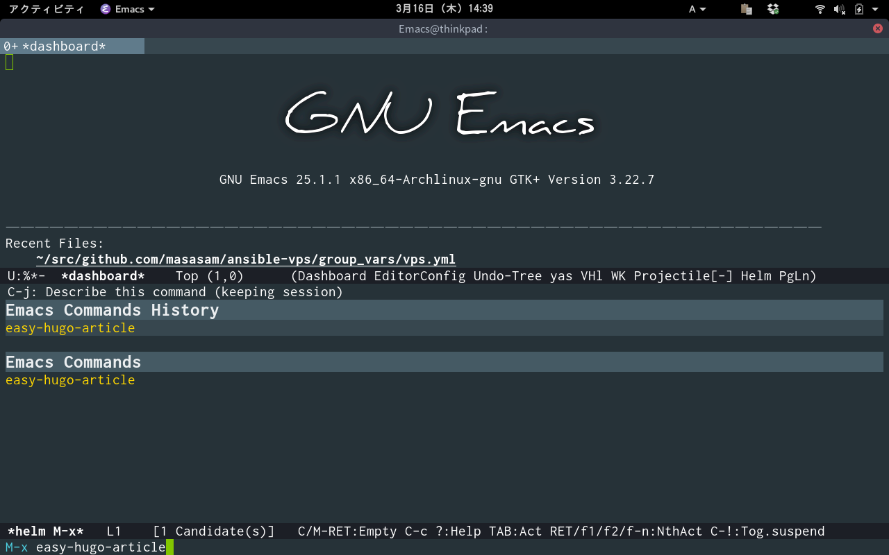

Display the list of articles you wrote  

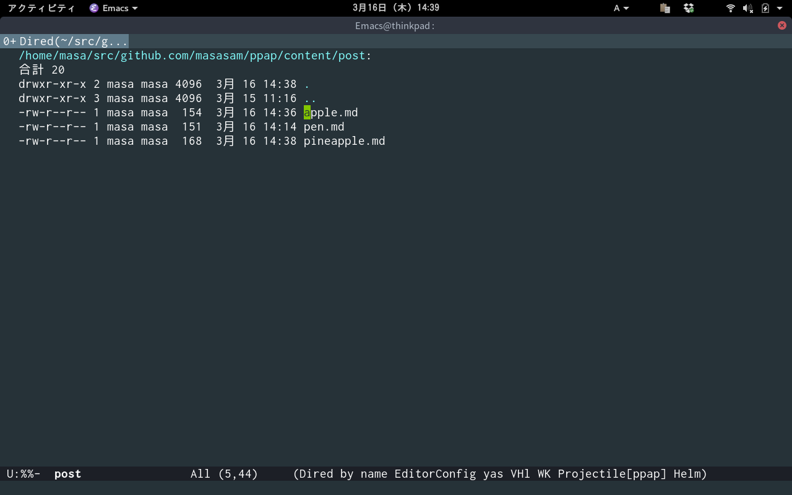

Well then it will be completed in one

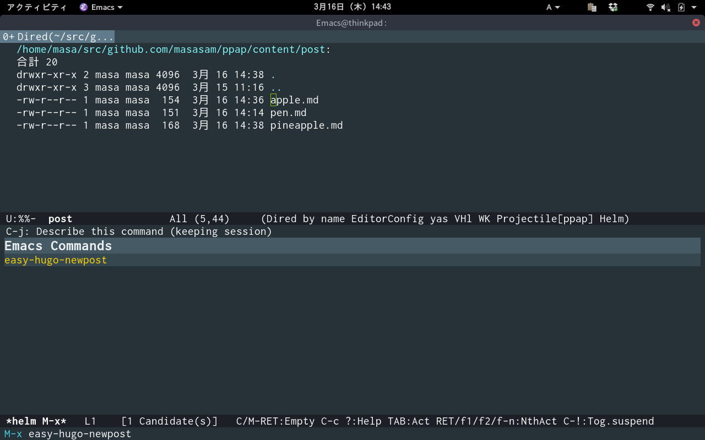

pen  

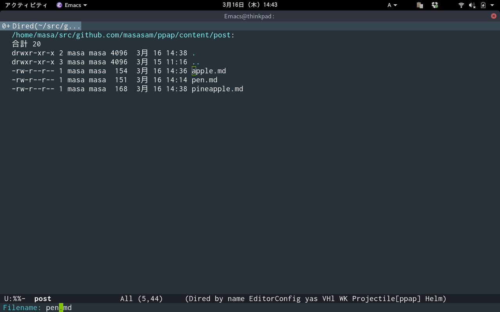

Blogs with the same file name can not be made  

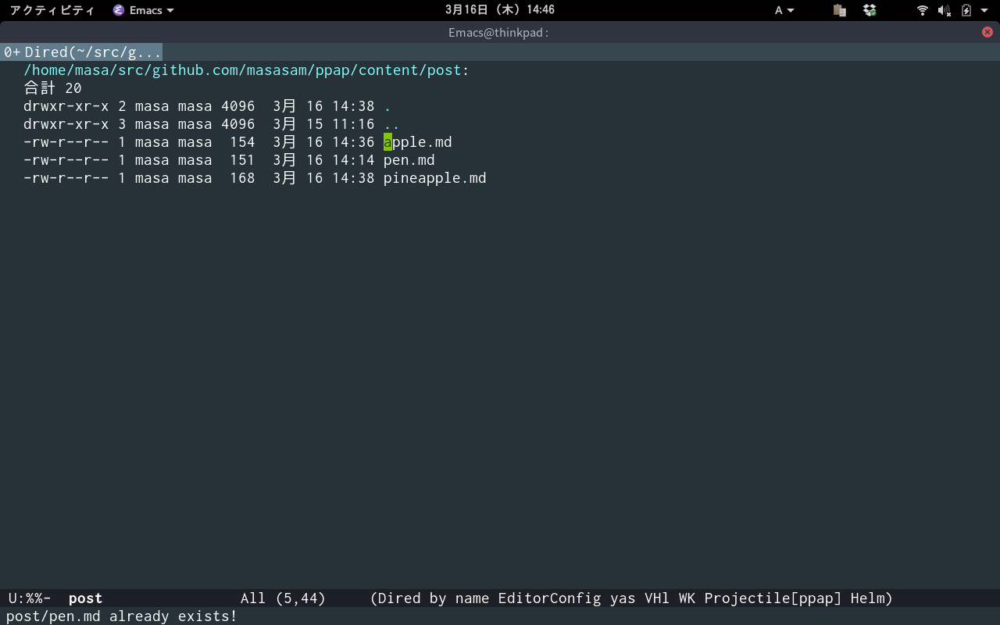

Rename PPA blog  

## Requirements

- Emacs 24.4 or higher
- hugo 0.19 or higher

## Sample Configuration

	(setq easy-hugo-basedir "~/hugo/")
	(setq easy-hugo-url "https://yourblogdomain")
	(setq easy-hugo-sshdomain "blogdomain")
	(setq easy-hugo-root "/home/blog/")
	(setq easy-hugo-previewtime "300")

## Preparation for useing this package

Write at ~/.ssh/config  

	 Host blogdomain
                        HostName "Your server's IP"
                        User "Your server's ssh login username"

Because blog is generated under /home/blog/ on the server  
Set it to reference it with nginx.  
Ssl uses certbot  

sample nginx.conf  

	server {
		listen 80;
		server_name yourdomain;
		return  301 https://yourdomain$request_uri;
		location / {
			root /home/blog;
		index	index.html index.htm;
		}
	}
	server {
		listen 443;
		server_name yourdomain;
		ssl on;
		ssl_certificate      /etc/letsencrypt/live/yourdomain/fullchain.pem;
		ssl_certificate_key  /etc/letsencrypt/live/yourdomain/privkey.pem;

	location / {
		root    /home/blog;
	index   index.html index.htm;
		}
	}

Confirm that PATH passes from emacs to go  
For example  

	(setenv "GOPATH" "~/go")
	(add-to-list 'exec-path (expand-file-name "~/go/bin"))
