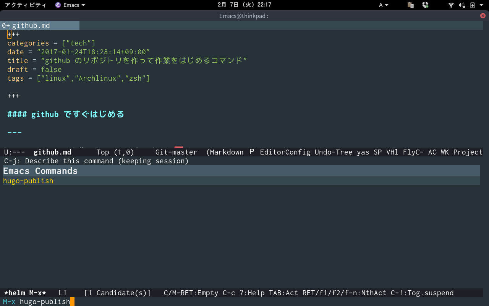

# hugo

Edit hugo with emacs  

## Image

M-x hugo-publish  

## Requirements

- Emacs 24 or higher
- hugo 0.16 or higher

## Sample Configuration

    (setq hugo-base-dir "~/src/github.com/masasam/blog/")
	(setq hugo-domain "blogdomain")
	(setq hugo-root "/home/blog/")

If publishing with GitHub Pages, set the theme as follows  

	(setq hugo-theme-of-github-page 'your theme name)

## When publishing with your server

~/.ssh/config  

	 Host blogdomain
                        HostName "your server's ip address"
                        User "your ssh login user"

Because blog is generated under /home/blog/ on the server  
Set it to reference it with nginx.  
Ssl uses certbot  

sample nginx.conf  

	server {
		listen 80;
		server_name yourdomain;
		return  301 https://yourdomain$request_uri;
		location / {
			root /home/blog;
		index	index.html index.htm;
		}
	}
	server {
		listen 443;
		server_name yourdomain;
		ssl on;
		ssl_certificate      /etc/letsencrypt/live/yourdomain/fullchain.pem;
		ssl_certificate_key  /etc/letsencrypt/live/yourdomain/privkey.pem;

	location / {
		root    /home/blog;
	index   index.html index.htm;
		}
	}

## When publishing with GitHub Pages

Create on GitHub <your-project>-hugo repository (it will host Hugo 's content)  
Create on GitHub <username>.github.io repository (it will host the public folder: the static website)  
git clone <<your-project>-hugo-url> && cd <your-project>-hugo  
Make your website work locally (hugo server -t <yourtheme>)  
Once you are happy with the results, Ctrl+C (kill server) and rm -rf public (don ’ t worry, it can always be regenerated with hugo -t <yourtheme>)  
git submodule add -b master git@github.com:<username>/<username>.github.io.git public  
